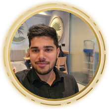

  

### Hi, I'm Vivek 👋

I'm early in my career, working in digital & tech at a life insurer — 
and I spend most of my time building the AI agents and automation I wish already existed.

---

### 🛠️ What I've been building

| | |
|---|---|
| **🤖 Personal AI assistant** A WhatsApp agent that schedules, summarises and replies for me — and places real voice calls with a live, animated call screen. | **🔍 Photo-authenticity scoring** A vision-model pipeline that flags reused, screenshotted or off-context field photos, with an analytics cockpit on top. |
| **📈 Investment research desk** An India-first research platform: portfolio X-ray, fundamentals & valuation lens, and a live market feed. | **🎯 Sales earnings planner** An earnings tracker and what-if simulator for field sales teams, with auto-generated PDF statements. |
| **🎬 Content engines** Automation pipelines that turn a single idea into a storyline, stills, voice-over and a finished video. | **🧲 Sourcing pipelines** Zero-cost engines that find and score candidates from self-published public sources. |

Most of this is private work — happy to walk through any of it.

### 🧰 Tools I reach for

  

  
  
  

### 🐍 Contributions

<picture>
  <source media="(prefers-color-scheme: dark)" srcset="https://raw.githubusercontent.com/Vivek4476/Vivek4476/output/snake-dark.svg"/>
  
</picture>

---

